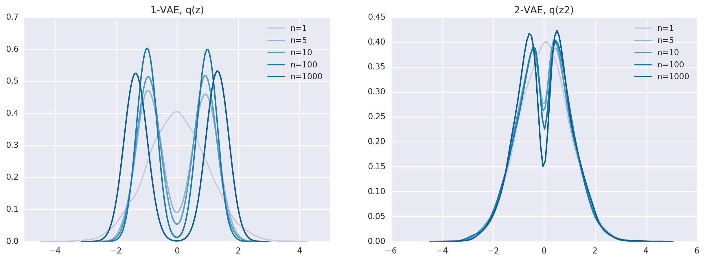
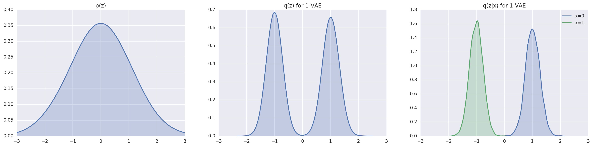
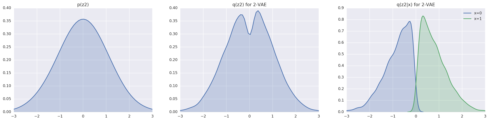

# One Bit VAE

A simple demonstration of the bits-back encoding mechanism by considering an extreme example where the data consists of only two distinct samples. The true entropy of the dataset is thus ~0.693 nats.

By varying the number of dimensions in the sample *while* keeping the dimension-independence of the decoder, we can easily demonstrate that Z strongly resists encoding X when the number of dimensions is small. This is because the smaller the number of dimensions, the less important it is for Z to encode global information about X. When `ndims=1`, it is possible to explain the data with the decoder alone, and Z is never used.

However, when a global encoding is necessary to coordinate the independent dimensions of the decoder, we fail to match the encoding distribution with the prior. A 2-layer VAE helps by expanding the variational family of the top layer.

Looking at the case of `ndims=1000`, we see very clearly the importance of expanding the variational family. The simplest generative process is: 

1. When z < 0, generate x = 1
2. When z >= 0, generate x = 0 (or vice versa)

This means the optimal posterior p(z|x) is a truncated Gaussian. If we are limited to the Gaussian family for q(z|x), we can never meaningfully minimize the KL(q(z|x) || p(z|x)). 

A 2-layer VAE has a Gaussian q(z2|z1). However, q(z2|x) is potentially arbitrarily complex, enabling better approximation of the truncated Gaussian.

